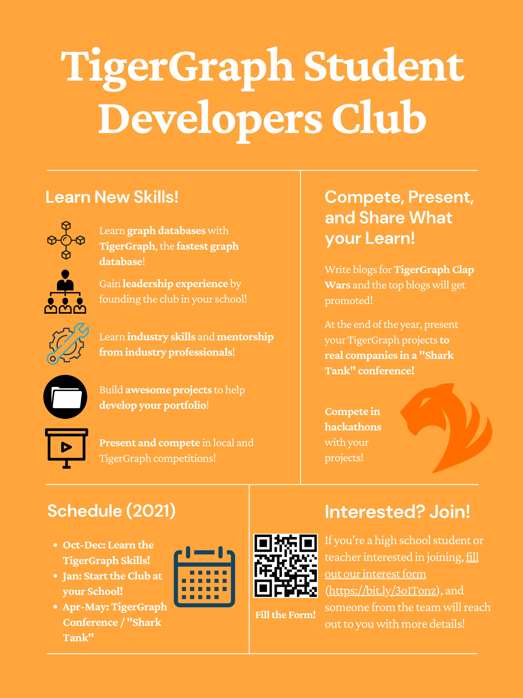

# Why Consider Joining?

By joining our student program, you'll...

* Learn about **Graphs with TigerGraph**, the most scalable graph database for enterprise 🐯
* Learn industry skills and gain **mentorship opportunities** from professionals 🧐
* Gain **leadership experience** by founding and running a club at your school 😎
* Present/Compete in **conferences, hackathons, "Tiger Tank"**, and more 🦈
* Build awesome projects to help **develop your portfolio** 🥳

&nbsp; &nbsp;

## **Fantastic Flyers**

Here's all of that info condensed in a more visual format!

&nbsp; &nbsp;

## **The Sacred Timeline**

For the 2021-2022 school year, here's the expected timeline:

| Date                | Event |
|---------------------|-------|
| Oct 2021 - Dec 2021|  We'll mentor those interested in mastering TigerGraph and the tools needed to start your club      |
| Dec 2021 - Jan 2022 | You can now **start creating a new club** at your school **with support from TigerGraph**      |
| Jan 2022 - Apr 2022 | **Lead project-based sessions** with your peers in the club! Start **building out projects** and **sharing** them       |
| Apr 2022 - May 2022 | **Present in the TigerGraph Students Conference** and **pitch your projects to real companies**      |

&nbsp; &nbsp;

Definitely sounds like a cool journey, with lots of experience, mentorship, and opportunities along the way! However,
this isn't all for our Student Developer Program. Although we didn't get a chance to share these yet, here are some upcoming extensions we have in the works

* Seasonal, themed competitions similar to FIRST Lego League, VEX
* <>

Who knows, maybe you could help shape this program with your ideas as well!

Guess there's only one way to find out, and that's to "Get Started" 😄

&nbsp; &nbsp;
