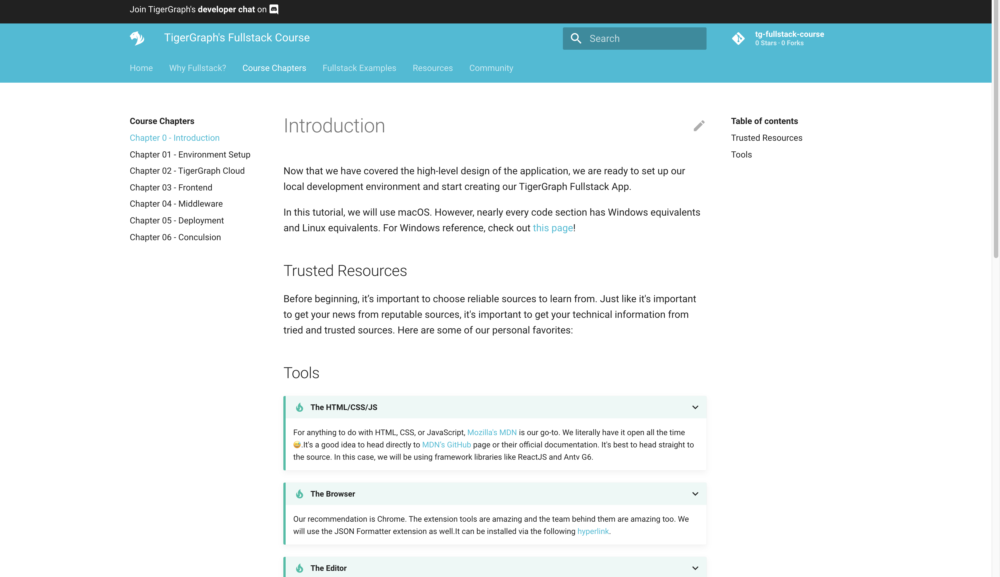

# Fullstack Apps

The best way to learn about Fullstack? Check out [this immersive, five-chapter guide](https://hhsu99.github.io/tg-fullstack-course/)
curated by TigerGraph on creating, modifying, and deploying your own fullstack app!

[Begin your TigerGraph + Fullstack Adventure](https://hhsu99.github.io/tg-fullstack-course/){ .md-button .md-button--primary }

&nbsp; &nbsp;

This **all-in-one guide** teaches users how to analyze their data using 🐯 TigerGraph Cloud 🐯 to create fullstack applications. Each component — ***the frontend, middleware, and cloud database*** — is meticulously detailed, resulting in a step-by-step journey to deploy one's fullstack app.

Here's a sneak peek!

By the end, you'll have created your own functioning app! 

&nbsp; &nbsp;
