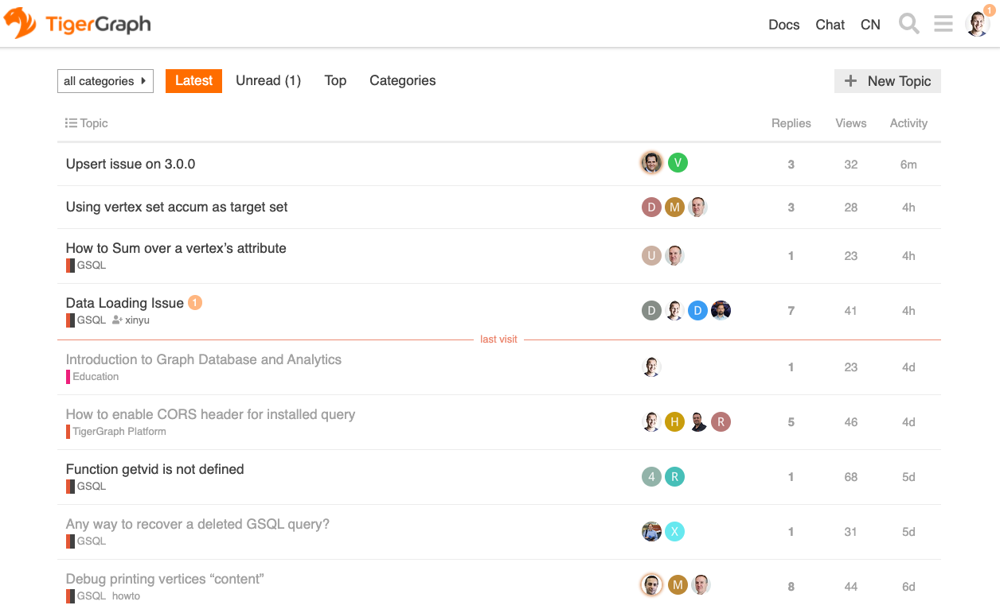

# Contact

Want to learn TigerGraph? Check out this list of places to start!

[Learn TigerGraph Cloud](https://www.tigergraph.com/blog/getting-started-with-tigergraph-3-0/){ .md-button .md-button--primary }
[Launch TigerGraph Cloud](https://tgcloud.io/){ .md-button .md-button--secondary }

### :material-cursor-default-click-outline: [**Community Fourm**](https://community.tigergraph.com)

### :material-cursor-default-click-outline:  [**TG Discord Chat**](https://discord.gg/F2c9b9v)

<iframe src="https://discordapp.com/widget?id=640707678297128980&theme=dark" width="100%" height="500" allowtransparency="true" frameborder="0" sandbox="allow-popups allow-popups-to-escape-sandbox allow-same-origin allow-scripts"></iframe>

* Use the `#general` channel for casual conversations around TigerGraph
* Use the `#support` channel for general questions or discussion about TigerGraph
* Use the `#tools` channel for questions about TigerGraph community tools
* Use the `#app-showcase` channel for showing the things you build
* Use the `#articles-blogs-news` channel for posting interesting things you find on the web

*There are many other channels available, check the channel list!*

&nbsp; &nbsp;
